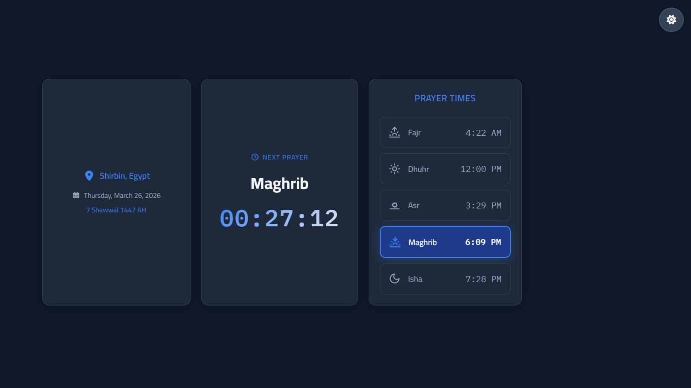

# 🕌 Prayer Times App

> A simple and modern web app that displays accurate daily prayer times based on your location.

---

## 📸 Preview



---

## 🚀 Live Demo

👉 https://mosokara.github.io/Prayer-Times-App/

---

## 📂 Repository

👉 https://github.com/MoSokara/Prayer-Times-API.git

---

## ✨ Features

- 📍 Detects your location automatically
- 🕌 Displays daily prayer times
- ⏳ Shows countdown to the next prayer
- 📅 Gregorian & Hijri dates
- 🌙 Dark mode support
- ⚡ Fast and lightweight

---

## 🛠️ Tech Stack

- HTML5
- CSS3
- JavaScript (ES Modules)
- Axios
- Aladhan API
- BigDataCloud API

---

## ⚙️ Installation

```bash
# Clone the repository
git clone https://github.com/your-username/prayer-times-app.git

# Open the project
cd prayer-times-app

# Run locally
open index.html
```

---

## 🌐 Deployment

This project works perfectly with:

- GitHub Pages
- Netlify
- Vercel

---

## 🧠 Improvements Made

- Fixed API and axios issues
- Improved module loading
- Added fallback for location errors
- Optimized performance (caching & fewer requests)
- Fixed date rendering bugs
- Improved code structure

---

## 🚧 Future Improvements

- 🔔 Prayer notifications
- 🧭 Qibla direction
- 🌍 Manual city selection
- 📅 Weekly prayer times

---

## 🤝 Contributing

Contributions are welcome!
Feel free to fork the repo and submit a pull request.

---

## 📄 License

This project is open source and available under the MIT License.

---

## 👨‍💻 Author

**Mohamed Sokara**

- GitHub: https://github.com/MoSokara
- LinkedIn: https://linkedin.com/in/mosokara

---

⭐ If you like this project, consider giving it a star!
